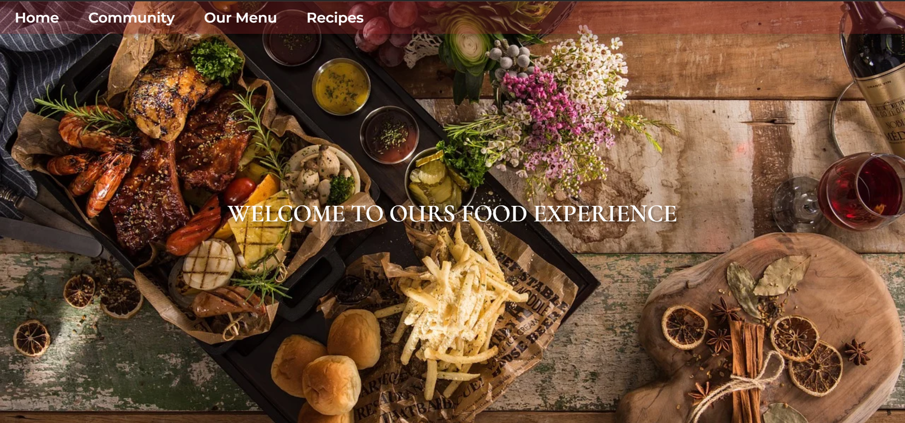

<div id="top"></div>

[![Contributors][contributors-shield]][contributors-url]
[![Forks][forks-shield]][forks-url]
[![Stargazers][stars-shield]][stars-url]
[![Issues][issues-shield]][issues-url]
[![MIT License][license-shield]][license-url]
[![LinkedIn][linkedin-shield]][linkedin-url]

<!-- PROJECT LOGO -->
<br />
<div align="center">
  <a href="https://github.com/VaniaTavares/studio-graphene">
    
  </a>

<h3 align="center">Ours Food Experience</h3>

  <p align="center">
    project_description
    <br />
    <a href="https://github.com/VaniaTavares/studio-graphene"><strong>Explore the docs </strong></a>
    <br />
    <br />
    <a href="https://vaniatavares.github.io/studio-graphene" target="blank">View Demo</a>
    ·
    <a href="https://github.com/VaniaTavares/studio-graphene/issues">Report Bug</a>
    ·
    <a href="https://github.com/VaniaTavares/studio-graphene/issues">Request Feature</a>
  </p>
</div>

<!-- TABLE OF CONTENTS -->
<details>
  <summary>Table of Contents</summary>
  <ol>
    <li>
      <a href="#about-the-project">About The Project</a>
      <ul>
        <li><a href="#built-with">Built With</a></li>
      </ul>
    </li>
    <li>
      <a href="#getting-started">Getting Started</a>
      <ul>
        <li><a href="#prerequisites">Prerequisites</a></li>
        <li><a href="#installation">Installation</a></li>
      </ul>
    </li>
    <li><a href="#usage">Usage</a></li>
    <li><a href="#contributing">Contributing</a></li>
    <li><a href="#contact">Contact</a></li>
    <li><a href="#acknowledgments">Acknowledgments</a></li>
  </ol>
</details>

<!-- ABOUT THE PROJECT -->

## About The Project
<div align="center">

</div>
Front end project developed with [Spooncular API](https://spoonacular.com/food-api) and a private API provided from a third party. The theme is a prototype for a restaurant webpage with Community, Menu and Random Recipes Sections.

<p align="right">(<a href="#top">back to top</a>)</p>

### Built With

- [React.js](https://reactjs.org/)

<p align="right">(<a href="#top">back to top</a>)</p>

<!-- GETTING STARTED -->

## Getting Started

To get a local copy up and running follow these simple example steps.

### Prerequisites

Having knowledge on use of npm or yarn.

### Installation

1. Get a free API Key at [https://spoonacular.com/food-api](https://spoonacular.com/food-api)
2. Clone the repo
   ```sh
   git clone https://github.com/VaniaTavares/studio-graphene.git
   ```
3. Install NPM packages
   ```sh
   npm install
   ```
4. Create a `.env.local` file and insert your API URL and/or API KEY
   ```.env.local
   REACT_APP_GRAPHENE_API=INSERT_YOUR_URL
   REACT_APP_RANDOM_RECIPES_API=INSERT_YOUR_BASE_URL_WITH_API_KEY
   ```

<p align="right">(<a href="#top">back to top</a>)</p>

<!-- USAGE EXAMPLES -->

## Usage

[Live Website](https://vaniatavares.github.io/studio-graphene)
<p align="right">(<a href="#top">back to top</a>)</p>

<!-- CONTRIBUTING -->

## Contributing

Contributions are what make the open source community such an amazing place to learn, inspire, and create. Any contributions you make are **greatly appreciated**.

If you have a suggestion that would make this better, please fork the repo and create a pull request. You can also simply open an issue with the tag "enhancement".
Don't forget to give the project a star! Thanks again!

1. Fork the Project
2. Create your Feature Branch (`git checkout -b feature/AmazingFeature`)
3. Commit your Changes (`git commit -m 'Add some AmazingFeature'`)
4. Push to the Branch (`git push origin feature/AmazingFeature`)
5. Open a Pull Request

<p align="right">(<a href="#top">back to top</a>)</p>

<!-- CONTACT -->

## Contact

Vânia Tavares - vntavares56@gmail.com

Project Link: [https://github.com/VaniaTavares/studio-graphene](https://github.com/VaniaTavares/studio-graphene)

<p align="right">(<a href="#top">back to top</a>)</p>

<!-- ACKNOWLEDGMENTS -->

## Acknowledgments

- [Studio Graphene](https://www.studiographene.com/)
- [Image Shields](https://shields.io/)
- [React Icons](https://react-icons.github.io/react-icons/search)

<p align="right">(<a href="#top">back to top</a>)</p>

<!-- MARKDOWN LINKS & IMAGES -->
<!-- https://www.markdownguide.org/basic-syntax/#reference-style-links -->

[contributors-shield]: https://img.shields.io/github/contributors/VaniaTavares/studio-graphene.svg?style=for-the-badge
[contributors-url]: https://github.com/VaniaTavares/studio-graphene/graphs/contributors
[forks-shield]: https://img.shields.io/github/forks/VaniaTavares/studio-graphene.svg?style=for-the-badge
[forks-url]: https://github.com/VaniaTavares/studio-graphene/network/members
[stars-shield]: https://img.shields.io/github/stars/VaniaTavares/studio-graphene.svg?style=for-the-badge
[stars-url]: https://github.com/VaniaTavares/studio-graphene/stargazers
[issues-shield]: https://img.shields.io/github/issues/VaniaTavares/studio-graphene.svg?style=for-the-badge
[issues-url]: https://github.com/VaniaTavares/studio-graphene/issues
[license-shield]: https://img.shields.io/github/license/VaniaTavares/studio-graphene.svg?style=for-the-badge
[license-url]: https://github.com/VaniaTavares/studio-graphene/blob/master/LICENSE.txt
[linkedin-shield]: https://img.shields.io/badge/-LinkedIn-black.svg?style=for-the-badge&logo=linkedin&colorB=555
[linkedin-url]: https://linkedin.com/in/vaniapltavares
[product-screenshot]: images/screenshot.png
